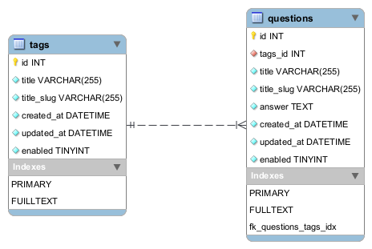

# MadeiraMadeira Faq
Este mini projeto foi desenvolvido para validar minhas qualificações e nível de conhecimento para o processo seletivo da empresa MadeiraMadeira. 

### Provisionar o ambiente

Para testar o aplicativo, use a configuração [docker-compose.yaml](docker-compose.yaml).

```sh
$ docker-compose build
$ docker-compose up -d
```
Acesse o navegador no endereço https://localhost:8081 para o sistema de FAQ.

Acesse o navegador no endereço https://localhost:8081/admin/faq/question para o gerenciar as perguntas e respostas.


#### Criar e popular o banco de dados
```sh
$ docker-compose exec madeira-faq composer phinx migrate
$ docker-compose exec madeira-faq composer phinx seed:run
```

#### Executar testes e gerar métricas do projeto
```sh
$ docker-compose exec madeira-faq composer check
```

#### Modelagem do banco de dados
